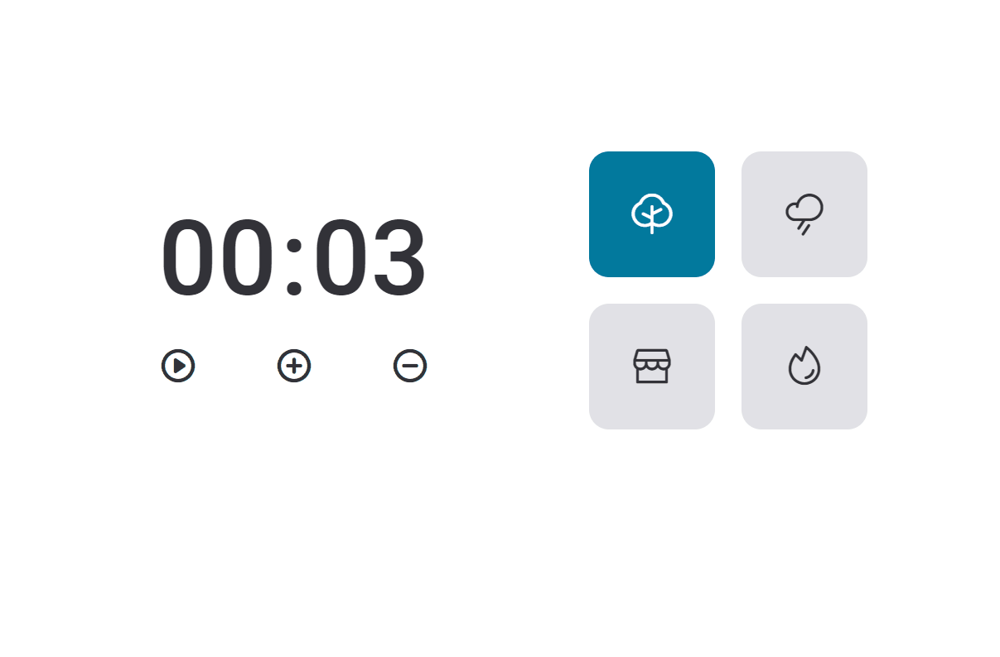

# Focus Timer

Esse projeto é um desafio da stage 05 do curso Explorer da [Rocketseat](https://www.rocketseat.com.br/).

## Demonstração



## Funcionalidades

- Contador de tempo
- Acrescentar e Diminuit o tempo em intervalos de 5 minutos
- 4 sons diferentes para auxíliar no foco

## Rodando localmente

Clone o projeto

```bash
  git clone https://github.com/juliaaoliveeirs/explorer-focus-timer.git
```

Entre no diretório do projeto

```bash
  cd explorer-focus-timer
```

Rode utilizando o Live Server

O app estará disponível no seu browser pelo endereço http://localhost:5500.

## Licença

[MIT](https://choosealicense.com/licenses/mit/)
